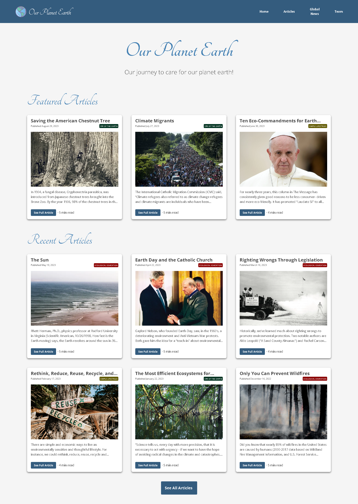

<h1>Our Planet Earth</h1>

## Table of Contents

- [Table of Contents](#table-of-contents)
- [Overview](#overview)
- [Built With](#built-with)
- [Purpose](#purpose)
- [Contact](#contact)
- [Acknowledgements](#acknowledgements)

## Overview

  
  
  Link to website - [Our Planet Earth](https://ourplanetearth.eco/)

Our Planet Earth was my first project into front-end web development. It was an eye-opening experience on how much it takes to actually put together a fully functioning website. It was challenging, but still very rewarding seeing my work come together piece by piece. Two of the more challenging aspects of this project were coming up with a design and working with React-Three-Fiber, a react library. The 3D Earth Globe still has issues with mobile since I did not think of the edge case where mobile can not hover like on desktop. However, I am thinking of ways to fix this issue in later refactors. Overall, working through this project has greatly increased my appreciation for design and the complexities of making everything responsive. Please feel free to visit and explore the website with the above link. I am always open to feedback and suggestions on how to make it even better!

## Built With

- [Next.js](https://nextjs.org/)
- [Tailwind](https://tailwindcss.com/) 
- [Hosted on Vercel](https://vercel.com/) 
- [React Three Fiber](https://docs.pmnd.rs/react-three-fiber/getting-started/introduction)
  
## Purpose

Our Planet Earth was made to bring awareness to climate change through blog posts. We promote clean air, clean water, and healthy soils; a greener world; sustainable practices; renewable energy; and conservation of worldwide ecosystems.

## Contact

- [Github](https://github.com/MCervone14)
- [My Portfolio](https://mcervone14.github.io/portfolio/) 

## Acknowledgements

Dr. Tom Cervone is a deacon at Holy Redeemer Catholic Church in Evansville, Indiana with 50 years of experience in ecology. He graduated from St. Bonaventure University, a Franciscan University.
